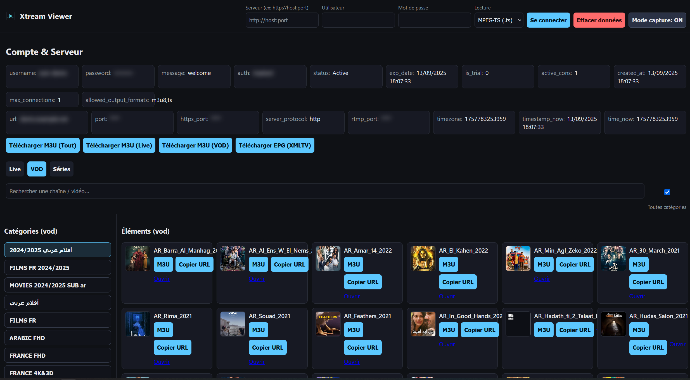

Xtream Viewer
=============

Petit site web (Node/Express + frontend statique) pour consulter un compte Xtream (Xtream Codes API / Xtream UI) :

- Affiche `user_info` et `server_info`
- Parcourt les catégories et chaînes Live (icônes incluses)
- Parcourt les catégories et VOD (icônes incluses)
- Séries (liste par catégorie)
- Téléchargement de playlists M3U (Tout / Live / VOD)
- Téléchargement de l’EPG (XMLTV)
- Bouton par élément pour générer un M3U “play” (ouvrir dans VLC)
- Génération de liens directs (URL / tentative `vlc://`)

Prérequis
---------

- Node.js 18+

Installation
------------

1. Installer les dépendances:

   npm install

2. Lancer le serveur en dev:

   npm run dev

3. Ouvrir l’URL:

   http://localhost:5173

Docker
------

- Construire et lancer avec Docker:

  docker build -t xtream-viewer .
  docker run --rm -it -p 5173:5173 --name xtream-viewer -e PORT=5173 xtream-viewer

- Ou via Docker Compose:

  docker compose up --build

Ensuite ouvrez: http://localhost:5173

Variables d’environnement:
- `PORT` (par défaut 5173) : port d’écoute dans le conteneur.

Application Windows (Electron)
------------------------------

Option “packagée” (EXE) basée sur Electron.

1) Installer les dépendances (une fois):

   npm install
   npm install --save-dev electron electron-builder

2) Lancer l’app desktop en dev:

   npm run desktop

3) Générer un installeur Windows (NSIS):

   npm run dist

Le binaire sera dans `dist/`. L’app embarque le serveur Express et ouvre l’interface sur `http://localhost:5173` dans une fenêtre native.

Icônes & Favicons
-----------------

- Web favicon: `public/favicon.svg` (vectoriel) et `public/logo.svg` (utilisé dans l’en‑tête). Remplacez ces fichiers pour personnaliser le branding.
- Icône Windows (Electron): placez une image `PNG` 512×512 dans `build/icon.png`.
  - Un placeholder est généré automatiquement à l’installation (`postinstall`). Remplacez‑le par votre logo pour un rendu propre (installateur et raccourcis).

Lecture dans VLC (version desktop)
----------------------------------

L’intégration “Ouvrir (VLC)” fonctionne uniquement dans l’application desktop (Electron). Navigateur web: les navigateurs bloquent le lancement de programmes locaux.

Prérequis
- Installer VLC sur votre poste.
- Chemins courants sous Windows:
  - `C:\Program Files\VideoLAN\VLC\vlc.exe`
  - `C:\Program Files (x86)\VideoLAN\VLC\vlc.exe`

Comment ça marche
- Au clic sur “Ouvrir (VLC)”, l’app tente d’ouvrir VLC avec l’URL du flux.
- Si VLC n’est pas trouvé, une invite vous demandera le chemin de `vlc.exe` (saisissez le chemin complet). Il sera réutilisé durant la session.
- Option avancée: définir la variable d’environnement avant de lancer l’app desktop:

  PowerShell (Windows):

      $env:VLC_PATH="C:\\Program Files\\VideoLAN\\VLC\\vlc.exe"; npm run desktop

Notes
- Cette fonctionnalité n’est disponible qu’en mode desktop; en mode web, utilisez le bouton “M3U” et ouvrez le fichier avec VLC.

Alternative ultra-simple (PWA locale):
- Dans Edge/Chrome: Menu > Plus d’outils > Installer cette application (site) → crée un raccourci fenêtré.

Utilisation
-----------

1. Saisir l’URL du panel (ex: `http://host:port`) + vos identifiants.
2. Choisir le format de lecture souhaité (MPEG-TS ou HLS).
3. Se connecter pour voir `user_info`/`server_info` et les onglets.
4. Naviguer par catégorie, cliquer sur “M3U” pour un flux unique, “Copier URL” pour le lien brut, ou “Ouvrir”.
5. Utiliser les boutons “Télécharger M3U (Tout/Live/VOD)” et “Télécharger EPG”.

Notes techniques
---------------

- Beaucoup de panels bloquent CORS / hotlink: le backend agit comme proxy API (pas de proxy vidéo streaming).
- Les liens direct `.ts` peuvent ne pas jouer dans le navigateur; utilisez VLC ou HLS avec un lecteur compatible.
- Le schéma `vlc://` peut nécessiter l’enregistrement du protocole sur votre OS; sinon téléchargez un `.m3u` et ouvrez-le dans VLC.
- Pour HLS, option “HLS (.m3u8)” dans la barre supérieure; la disponibilité dépend du panel/transcoding.

Sécurité
-------

- Les identifiants sont envoyés au backend à chaque requête (pas de session côté serveur, simplification locale). Ne déployez pas tel quel sur Internet.
- Évitez d’exposer ce serveur publiquement sans ajout d’authentification et de chiffrement (HTTPS, sessions, rate-limit, logs réduits).

Captures d’écran
-----------------

Pour ajouter une capture d’écran au README sans exposer d’informations sensibles:

1. Activez le « Mode capture » dans l’app (bouton en haut à droite) pour masquer les données sensibles, puis faites votre capture.
2. Enregistrez-la dans ce dépôt, par exemple dans `docs/screenshot.png`.
3. Référencez-la dans ce README via un lien relatif:

   

Conseils:
- Préférez des images ≤ 1–2 Mo (compressez si besoin).
- Utilisez un format PNG pour l’UI (ou WebP si vous préférez), à déposer dans `docs/`.
- Si vous avez plusieurs vues, créez `docs/screenshots/` et ajoutez-les avec des légendes.
